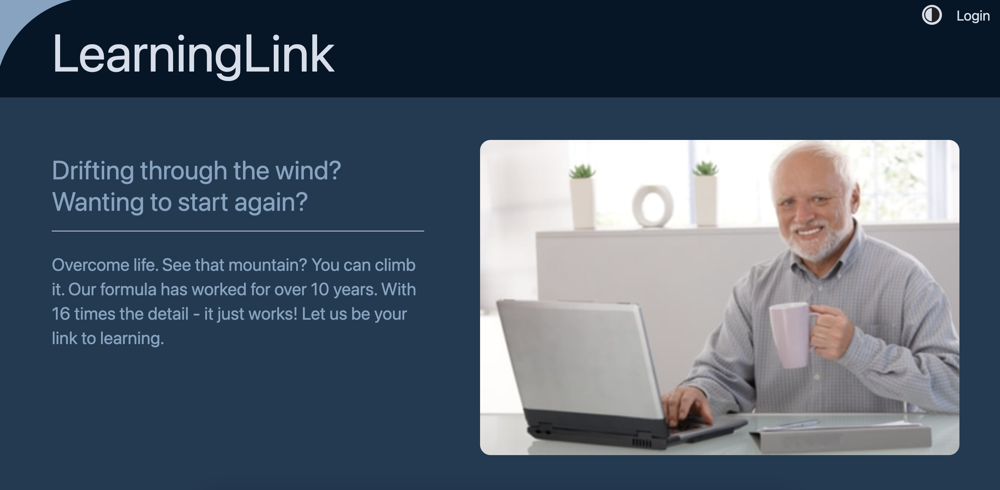
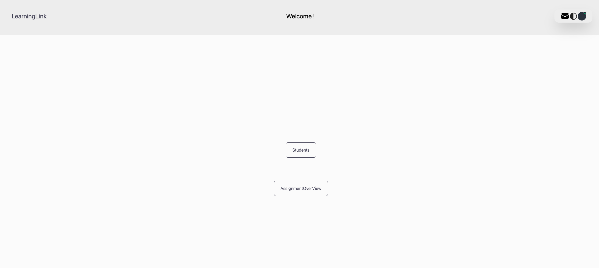
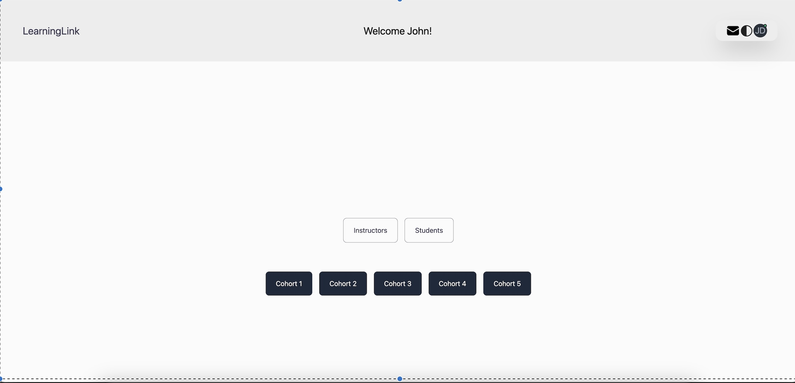
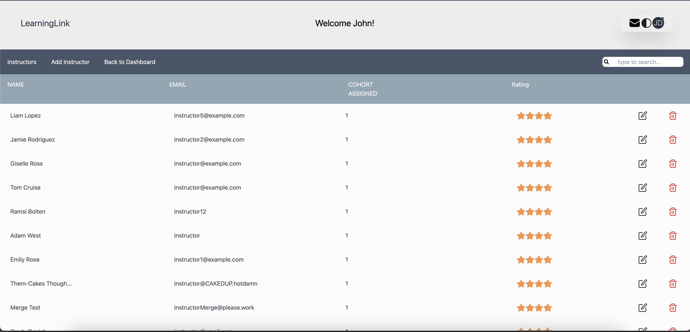
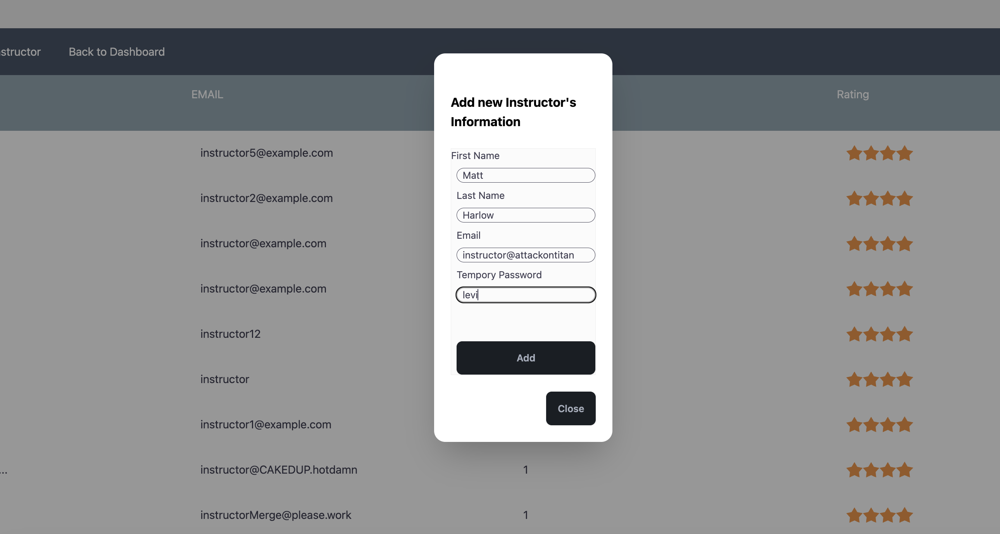
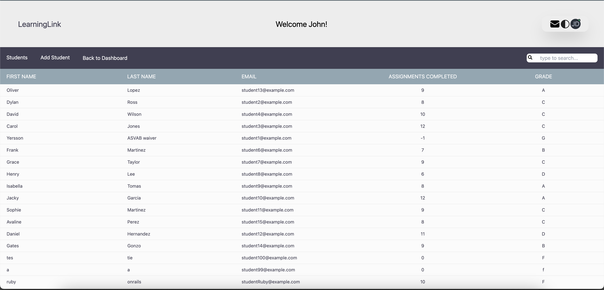

# 🖥️ LinkLearning

This project is a full-stack application that aims to simulate the business needs of a client-to-engineering-team relationship. The client requested a minimally viable product for a learning app within their education services, emphasizing functionality, modern design, and authentication/session management. Link Learning uses a Vercel-hosted PostgreSQL database and Next.js for the frontend.

## Table Of Contents

- [Getting Started](#getting-started)
- [Configuration](#configuration)
- [File Structure](#file-structure)
- [Features](#features)
- [Architecture](#architecture)
- [API Documentation](#api-documentation)
- [Testing](#testing)
- [Contributing](#contributing)
- [Credits](#credits)
- [License](#license)
- [Contact](#contact)

## 🚀 Getting Started

To get a copy of the project up and running on your local machine for development and testing purposes, follow these steps [below](https://github.com/Blue-Ocean-MCSPA/link-learning/blob/main/README.md#-installing).

### 📋 Prerequisites

You need to have Node.js and npm installed on your machine. If you don't have them installed, you can download them from [here](https://nodejs.org/en/download/).

### 🔧 Installing

1. Fork and clone the repo.
2. Navigate to the project directory.
3. Run `npm install` to install the dependencies.
4. Run `npm build` to build the project.
5. Run `npm start` or `npm run dev` to start the server.

### 🔧 API

#### GET

- /api/users - Get a list of all users
- /api/reviews - Get a list of all reviews
- /api/reviews - Get a list of all reviews
- /api/reviews - Get a list of all reviews
- /api/reviews - Get a list of all reviews
- /api/reviews - Get a list of all reviews

## 🛠️ Built With

- <a href="https://developer.mozilla.org/en-US/docs/Web/JavaScript" target="_blank" rel="noreferrer"> - Core language used</a>
- <a href="https://nodejs.org/en/" target="_blank" rel="noreferrer"> - JavaScript runtime</a>
- <a href="https://nextjs.org/docs" target="_blank" rel="noreferrer"> - Node.js web application framework and build tool</a>
- <a href="https://www.postgresql.org/" target="_blank" rel="noreferrer"> - External relational database</a>
- <a href="https://render.com/" target="_blank" rel="noreferrer"> - Deployment platform</a>
- <a href="https://developer.mozilla.org/en-US/docs/Glossary/HTML5" target="_blank" rel="noreferrer"> Markup language</a>
- <a href="https://www.w3.org/TR/CSS/#css" target="_blank" rel="noreferrer"> - Styling language</a>
- <a href="https://tailwindcss.com/" target="_blank" rel="noreferrer"> - CSS tool used</a>

---

### Landing Page

The landing page for this project utilizes a minimalist approach with three colors selected from the VS Code Night Owl Light/Dark themes, as requested by the client. The dark mode toggle is located on the top right, alongside the login button. The login button routes the user to the login page.


###### Light mode



###### Dark mode

---

### Login Page

The login page allows the user to enter credentials as one of three roles - admin, instructor, or student. JWT and Bcrypt authentication is implemented in order to route the user to the appropriate view. The different functionalities located in each view is further elaborated in their respective sections below.


---

## 👨‍🏫 Instructor view

### Description

The Instructor View is a component of our learning platform designed specifically for instructors. It provides tools and features to help instructors manage cohorts, track student progress, and facilitate effective teaching.

### Key Features

- **Student Analytics**: Monitor student progress, view grades, and track attendance to assess performance effectively.

- **Edit Student Information**: Instructors have the ability to edit student details, including grades, attendance records, and personal information.

- **Communication Tools**: Stay connected with students through built-in messaging features, allowing instructors to send announcements, reminders, and personalized messages directly to students.



---

### MESSAGES

The messages component provides capabilities for creating, retrieving, updating, and deleting messages within threads without the need for authentication. Here, you'll find essential information to get started with our API endpoints.

### Key Features:

GET: Retrieve messages from a specific thread or a list of all message threads.
POST: Create a new message within a thread.
PATCH: Update an existing message in a thread.
DELETE: Remove a message from a thread.

### All API requests should be made to the following base URL:

http://localhost:3000/msg

### Endpoints

GET /messages
Description: Retrieve a list of all message threads.

POST /messages
Description: Create a new message within a specific thread.

PATCH /{messageId}
Description: Update an existing message in a thread.

DELETE /{messageId}
Description: Remove a message from a thread.

## API Documentation

To connect to your Postgres database using the Vercel Postgres SDK:

1. Install the SDK:
   npm install @vercel/postgress
2. Import the 'sql' function from the SDK

```javascript
import { sql } from "@vercel/postgres";
```

3. Construct SQL queries using the 'sql' function

```javascript
export async function GET(request) {
  const data = await sql`SELECT * FROM users`;
  return NextResponse.json({ data }, { status: 200 });
}
```

4. Examples:

- CREATE TABLE posts (likes INT); // Create a new table in the database
- SELECT \* FROM posts; // Get all posts in the database
- SELECT \* FROM posts WHERE likes > ${likes}; // Get all posts with more than 100 likes
- INSERT INTO posts (likes) VALUES (${likes}); // Insert a new post into the database
- UPDATE posts SET likes = 200; // Update all posts to have 200 likes
- DELETE FROM posts; // Delete all posts in the database

5. Preventing SQL injections
   The Vercel Postgres SDK autocamtically prevents SQL injections by using parameterized queries. Parameters are extracted and added to an array before being sent to the PostgreSQL server. This ensures your queries are sanitized and secure.

## Dynamic Routing

In our API, you can utilize dynamic routing to handle requests based on specific IDs. This allows you to create flexible endpoint structure where requests are routed after the provided ID.

### Usage

To implement dynamic routing with [id], follow these steps

1. Create a Dynami Folder: Set up a folder in your API folder with the format `[id]` where `[id]`represents the placeholder for the ID parameter.
2. Define Route Handlers: Within the dynamic folder, define route handlers for each HTTP method(GET, PATCH, DELETE) to handle requests targeting specific IDs.
3. Handle Requests: Catpture the ID from the request URL or data and use it to perform CRUD operations.

### Example

Consider the following folder structure in your API:

```javascript
/app
    /api
        /[id]
            route.js
```

Inside the route.js file, you can access the ID parameter from the request URL and process the request.

## Request Handling

Here are some examples on how you can implement each route in your route.js file

- GET Request:

- PATCH Request:
- DELETE Request:

### Example:

```javascript
// /api/[id]/route.js
export async function GET(request, id) {
  const data = await request.json();
  id = parseInt(id.params.id) || data.id;
  const result = ;
  return NextResponse.json({ result }, { status: 200 });
}
```

### Note

Ensure proper error handling and validation to handle cases where ID does not exist or the request fails due to other reasons### Admin Page 🗂️

---

## 🗂️ Admin view

### Description

The Admin View is a component of our learning platform designed specifically for Admins of the platform. Has the capabilities of adding new intructors and students to the database. It has full CRUD opaerations connected to an API. It provides tools and features to help Admins manage Instructors, Students, and Cohorts, track student progress, and facilitate effective teaching.

### Key Features

- **Add Instructors Tools**: Administrators can add new instructors to the system, providing necessary information such as name, contact details, and expertise.

- **Add Students Tools**: Admins can register new students into the system, including their personal details and enrollment information.

- **Monitor Student Progress**: The dashboard allows administrators to track the progress of individual students, including course completion rates, grades, and any additional performance metrics.

- **Instructor Rating**: Administrators can rate instructors based on their teaching performance using a scalable rating system, providing valuable feedback for improvement.
- **Student Analytics**: Monitor student progress, view grades, and track attendance to assess performance effectively.

- **Edit Student Information**: Instructors have the ability to edit student details, including grades, attendance records, and personal information.

- **Communication Tools**: Stay connected with students through built-in messaging features, allowing instructors to send announcements, reminders, and personalized messages directly to students.


The Admin adding a new instructor to the web application. This also saved the new instructors information to the DataBase




Displays the list of students with the same CRUD features as the instructors
 
