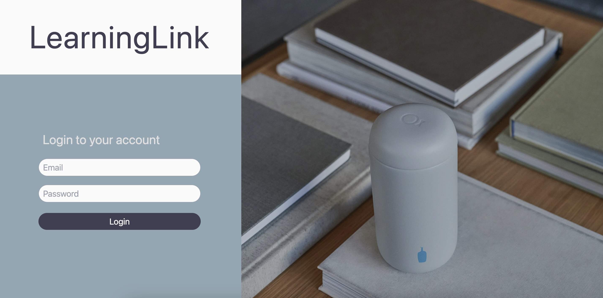

# 🖥️ LinkLearning

This project is a full-stack application that aims to simulate the business needs of a client-to-engineering-team relationship. The client requested a minimally viable product for a learning app within their education services, emphasizing functionality, modern design, and authentication/session management. Link Learning uses a Vercel-hosted PostgreSQL database and Next.js for the frontend.

## 🚀 Getting Started

To get a copy of the project up and running on your local machine for development and testing purposes, follow these steps [below](https://github.com/Blue-Ocean-MCSPA/link-learning/blob/main/README.md#-installing).

### 📋 Prerequisites

You need to have Node.js and npm installed on your machine. If you don't have them installed, you can download them from [here](https://nodejs.org/en/download/).

### 🔧 Installing

1. Fork and clone the repo.
2. Navigate to the project directory.
3. Run `npm install` to install the dependencies.
4. Run `npm build` to build the project.
5. Run `npm start` or `npm run dev` to start the server.
   
### 🔧 API

#### GET
* /api/users - Get a list of all users
* /api/reviews - Get a list of all reviews
* /api/reviews - Get a list of all reviews
* /api/reviews - Get a list of all reviews
* /api/reviews - Get a list of all reviews
* /api/reviews - Get a list of all reviews

## 🛠️ Built With

* <a href="https://developer.mozilla.org/en-US/docs/Web/JavaScript" target="_blank" rel="noreferrer"> - Core language used</a>
* <a href="https://nodejs.org/en/" target="_blank" rel="noreferrer"> - JavaScript runtime</a>
* <a href="https://nextjs.org/docs" target="_blank" rel="noreferrer"> - Node.js web application framework and build tool</a>
* <a href="https://www.postgresql.org/" target="_blank" rel="noreferrer"> - External relational database</a>
* <a href="https://render.com/" target="_blank" rel="noreferrer"> - Deployment platform</a>
* <a href="https://developer.mozilla.org/en-US/docs/Glossary/HTML5" target="_blank" rel="noreferrer"> Markup language</a>
* <a href="https://www.w3.org/TR/CSS/#css" target="_blank" rel="noreferrer"> - Styling language</a>
* <a href="https://tailwindcss.com/" target="_blank" rel="noreferrer"> - CSS tool used</a>

***

### Landing Page

The landing page for this project utilizes a minimalist approach with three colors selected from the VS Code Night Owl Light/Dark themes, as requested by the client. The dark mode toggle is located on the top right, alongside the login button. The login button routes the user to the login page.

###### Light mode

###### Dark mode

***

### Login Page

The login page allows the user to enter credentials as one of three roles - admin, instructor, or student. JWT and Bcrypt authentication is implemented in order to route the user to the appropriate view. The different functionalities located in each view is further elaborated in their respective sections below.

***
## 👨‍🏫 Instructor view

### Description

The Instructor View is a component of our learning platform designed specifically for instructors. It provides tools and features to help instructors manage cohorts, track student progress, and facilitate effective teaching. It is designed to provide instructors with a comprehensive set of tools to manage their classes effectively,

* **Technology Stack**: Built using Next.js version 14, leveraging the new App router feautre for improved routing and nav. The frontend is develped with React, used for its powerful state management and component based architecture to create a dynamic and interactive user experience. Styling is done with ailwind CSS, which allows for rapid UI development with its utility-first approach.

### File Structure
* **app > Components > instructor**: The files for the Instructor Dashboard are organized wihtin the 'Components' folder, which is located inside the 'app' folder. This structure helps in keeping the dashboard-realted components separate from other parts of the app, ensuring maintanilbility and scalibility.

### Key Features
* **Student Analytics**: Instructors can view detailed analytics about student performance, including, grades, attendance, and assignment completion.

* **Cohort Management**:Instructors can manage different cohorts, view cohort details, and track overall cohort progress.

* **Assignment Overview**: A dedicated section for managing assignments, where instructors can view all assignments, their due dates, and grades.

* **Communication Tools**: Built-in messaging features enable instructors to communicate with students directly, send announcements, and provide feedback.

### Differences from Student Dashboard
* **Cohort Management**: Instructors can manage multiple cohorts, whereas students only have access to their own cohort information.

* **Edit Capabilities**: Instructors have the ability to edit student information, grades, and attendance records, which is not possible on the Student Dashboard.

